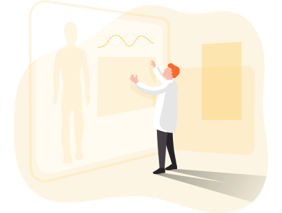

### Hi there 👋
My name is **Subidit Nandy**.

#### 2022 🤖 ChatGPT
#### 2020 🦠 COVID-19
#### 2016 💃 TikTok
#### 2012 📚 MOOC (Massive open online courses)
#### 2011 📳 Snapchat, Google+
#### 2010 🤳 Instagram
#### 2009 💱 Bitcoin
#### 2008 📻 Spotify, Dropbox, GitHub
#### 2007 📱 iPhone 
#### 2006 ☁️ AWS, Twitter
#### 2005 🗳️ Git, YouTube, Reddit
#### 2004 👀 Facebook, Flickr, Gmail
#### 2003 🏴‍☠️ The Pirate Bay, Myspace, Skype, LinkedIn
#### 2001 📖 Wikipedia, BitTorrent
#### 1999 🎧 Napster
#### 1998 💸 PayPal
#### 1997 🔎 Google
#### 1996 📧 Hotmail
#### 1995 🧌 eBay, Craigslist, Amazon
#### 1994 🗞️ Netscape, Yahoo!
#### 1991 🌐 First website [info.cern.ch](http://info.cern.ch/hypertext/WWW/TheProject.html)
#### 1990 🎞️ IMDb (imdb.com in 2006)
#### 1989 📟 dialup internet, email
